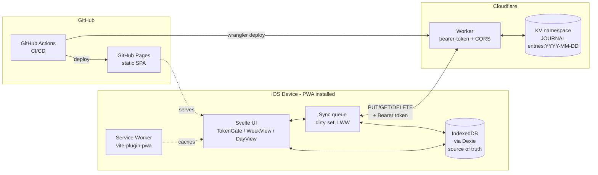
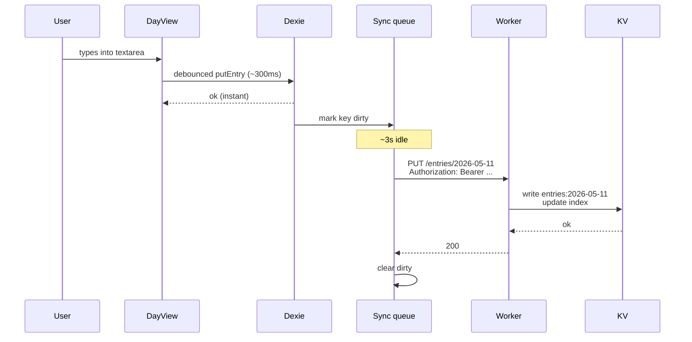
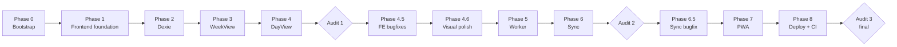

# Journal Calendar — Phased Implementation Plan

## How to use this plan across sessions

This plan is the single source of truth for the build. Every phase is executed in a fresh Cursor chat with limited context. Each phase below contains everything a clean agent needs:

- **Goal** — one-sentence outcome.
- **Model** — which model to launch this session with, and why.
- **Prerequisites** — what must exist in the repo before the phase starts.
- **Reads** — the only docs the session needs (always: `AGENTS.md` + `PLAN.md`; sometimes specific files from prior phases).
- **Tasks** — concrete, ordered work items.
- **Deliverable** — files/artifacts that exist when the phase is done.
- **Acceptance criteria** — observable checks the user runs to confirm "done."

**Critical: the very first action of Phase 0 is to save this plan as `PLAN.md` at the repo root.** Every subsequent session reads it from there.

## Model strategy

Per-phase model selection. Rationale:

- **opus-4.7** — used for (a) the phases with the most design risk (`WeekView` visual fidelity, `sync` merge logic) and (b) every audit checkpoint, where the agent has to load the full project state and re-derive whether the plan still holds.
- **sonnet-4.6** — used for everything else: well-defined scaffolding, routing, CRUD on Dexie, the small worker, PWA config, and CI. These phases have low ambiguity and short critical paths, so the cheaper/faster model is appropriate and reduces context-window pressure.


| Phase                   | Model        | Why                                                                                           |
| ----------------------- | ------------ | --------------------------------------------------------------------------------------------- |
| 0 — Bootstrap           | sonnet-4.6   | Mechanical scaffolding.                                                                       |
| 1 — Frontend foundation | sonnet-4.6   | Routing + a 1-input gate, no real backend yet.                                                |
| 2 — Dexie data layer    | sonnet-4.6   | Small, well-defined CRUD.                                                                     |
| 3 — WeekView UI         | **opus-4.7** | Visual fidelity is the heart of the app; paper/spiral/tab CSS is non-trivial.                 |
| 4 — DayView UI          | sonnet-4.6   | Simpler than WeekView; mostly textarea + auto-save.                                           |
| **Audit 1**             | **opus-4.7** | Compares the running local-only MVP to AGENTS.md and rewrites the remaining plan if needed.   |
| 4.5 — FE bugfixes       | sonnet-4.6   | Two tiny, isolated fixes called out by Audit 1 (tsconfig flag + Router redirect bug). Added by Audit 1. |
| 4.6 — Visual polish     | sonnet-4.6   | Two isolated CSS changes: card-per-day vertical separation + denser line rhythm. Low ambiguity; pure CSS + template. Added by user after Audit 1. |
| 5 — Worker backend      | sonnet-4.6   | Well-defined API surface, ~150 LOC of TS.                                                     |
| 6 — Sync layer          | **opus-4.7** | LWW + dirty-set + backoff + pull loop is the trickiest logic in the app.                      |
| **Audit 2**             | **opus-4.7** | Validates that sync is actually correct on two devices before locking in PWA & deploy phases. |
| 6.5 — Sync bugfix       | sonnet-4.6   | Two surgical, isolated fixes called out by Audit 2 — `push()` re-arm on success + `worker:dev` env flag. Added by Audit 2. |
| 7 — PWA polish          | sonnet-4.6   | Config + manifest + icons.                                                                    |
| 8 — Deployment & CI     | sonnet-4.6   | Workflow YAML + vite base path.                                                               |
| **Audit 3 (final)**     | **opus-4.7** | Post-deploy review on a real device.                                                          |


If a sonnet-4.6 phase fails or stalls, the user re-runs it on opus-4.7. The plan doesn't pre-bake fallbacks.

## Audit checkpoint protocol

An audit session always does the same thing:

1. Reads `AGENTS.md`, `PLAN.md`, and any prior `audits/audit-*.md`.
2. Inspects the current repo state — `git status`, `git log --oneline`, file tree, `package.json`, key config files.
3. Runs the verifications the just-completed phases promised in their **Acceptance criteria** (or guides the user to do so on-device when an iOS device is required).
4. Compares observed state against the plan. Lists:
  - What was actually built.
  - What's missing or different from the plan.
  - Bugs, regressions, or smells found.
  - Whether any locked-in decision in AGENTS.md needs revisiting.
5. Writes `audits/audit-N.md` with the above.
6. If the remaining phases need adjusting, edits `PLAN.md` in place (updates tasks, splits a phase, adds a phase, retires a phase, swaps models). Logs every change to `PLAN.md` in the audit file.

Audit sessions are read-mostly on the codebase. They can run `npm run build`, `npm run dev`, `wrangler dev`, `curl`, but they should not refactor unrelated code. Any non-trivial code change identified by the audit becomes a task in a subsequent phase, not work the audit session does itself.

## Conscious deviations from AGENTS.md

Both decided in this planning session and overriding the corresponding items in `AGENTS.md`:

- **No "Back up" button.** AGENTS.md lists "Manual one-tap 'Back up'" as in-scope. Removed. The worker also drops its `GET /export` endpoint since nothing consumes it. Remote sync is the sole durability path; if the access code is lost, the project owner restores data from KV out-of-band.
- **No in-app onboarding / install instructions.** AGENTS.md flags an open item to build a first-visit page explaining "Tap Share → Add to Home Screen." Removed. The project owner explains the install in a private message to the friend.
- **No automated tests.** AGENTS.md doesn't take a position on testing. Decided in planning: no Vitest, no Playwright, no test scaffolding. Manual testing on iOS Safari is the only QA gate.

The plan otherwise honors AGENTS.md.

## Architecture at a glance




Data flow per edit:




Build order (frontend first):




---

## Phase 0 — Repo bootstrap [sonnet-4.6]

**Goal.** A scaffolded Svelte 5 + Vite + TS + Tailwind v4.2 frontend at the repo root, with the directory skeleton and npm scripts the rest of the plan expects. No Cloudflare yet, no worker code yet.

**Prerequisites.** Empty workspace except for `AGENTS.md`.

**Reads.** `AGENTS.md`, this plan.

**Tasks.**

1. Save this plan verbatim as `PLAN.md` at the repo root.
2. `git init` (if not initialized). Create `.gitignore`: `node_modules`, `dist`, `.wrangler`, `.dev.vars`, `.env`, `.env.local`, `.DS_Store`.
3. Scaffold the frontend in place: `npm create vite@latest . -- --template svelte-ts`, accepting overwrite of conflicting files. Verify `npm run dev` produces a blank Svelte page on `localhost:5173`.
4. Install runtime deps: `npm i svelte-routing dexie date-fns`.
5. Install Tailwind v4.2 the v4-native way:
  - `npm i -D tailwindcss@^4.2 @tailwindcss/vite@^4.2`.
  - In `vite.config.ts`, add the `@tailwindcss/vite` plugin to `plugins`.
  - Create `src/styles/app.css` containing only `@import "tailwindcss";` (v4 does not need `tailwind.config.js` or `postcss.config.js` by default).
  - Import `./styles/app.css` from `src/main.ts`.
  - Verify a Tailwind class (e.g. `class="bg-red-500"`) on the default `App.svelte` actually renders red.
6. Set `tsconfig.json` `compilerOptions`: `strict: true`, `noUncheckedIndexedAccess: true`, `verbatimModuleSyntax: true`.
7. Create the directory skeleton per AGENTS.md "Architecture Sketch." Empty placeholder files (TS files just with `export {}`, Svelte files with empty `<script lang="ts">`):
  - `src/routes/TokenGate.svelte`, `src/routes/WeekView.svelte`, `src/routes/DayView.svelte`
  - `src/components/SpiralBinding.svelte`, `src/components/DayTab.svelte`, `src/components/MonthPicker.svelte`
  - `src/data/db.ts`, `src/data/api.ts`, `src/data/sync.ts`
  - `src/state/auth.ts`
  - `src/styles/paper.css` (empty for now)
  - `audits/.gitkeep` (so audit reports have a home)
  - (No `src/data/backup.ts`, no `src/components/BackupButton.svelte` — backup is removed.)
8. Add npm scripts in `package.json`:
  - `dev`, `build`, `preview` (from Vite scaffold).
  - `worker:dev` — placeholder `"echo 'worker not yet scaffolded — Phase 5'"`.
  - `worker:deploy` — same placeholder.
9. Write a `README.md` skeleton: title, one-line description, "see `PLAN.md` for build phases and `AGENTS.md` for project context."

**Deliverable.** A repo where `npm run dev` opens a blank Svelte page with Tailwind v4.2 working. Directory skeleton matches AGENTS.md. `PLAN.md` is committed.

**Acceptance criteria.**

- `npm run dev` opens `localhost:5173` showing the default Svelte scaffold.
- A Tailwind utility class on any element renders the expected style.
- `tree -L 3 src` matches the directory skeleton in AGENTS.md (minus the deviations above).
- `git log --oneline` shows at least one commit; `PLAN.md` is present in `git show HEAD --stat`.

---

## Phase 1 — Frontend foundation: routing, auth state, TokenGate (local-only) [sonnet-4.6]

**Goal.** Three routes wired with `svelte-routing`, an auth store backed by `localStorage`, a TokenGate screen with Russian copy. **No backend yet — TokenGate accepts any non-empty token and stores it; real `/health` validation is added in Phase 6.**

**Prerequisites.** Phase 0.

**Reads.** `AGENTS.md` (Auth model, Architecture Sketch), `PLAN.md`.

**Tasks.**

1. `src/state/auth.ts`: a Svelte store backed by `localStorage` key `journal:token`. Exports `token` (readable store, `string | null`), `setToken(value)`, `clearToken()`. Hydrate from `localStorage` on module load.
2. `src/App.svelte`:
  - Subscribe to `token`.
  - If `null`, render `<TokenGate />` full-screen.
  - Otherwise mount `<Router>` from `svelte-routing` with three routes:
    - `/` — redirects to `/week/<current-ISO-Monday>` using `date-fns` `startOfISOWeek` + `format(d, 'yyyy-MM-dd')`.
    - `/week/:isoMonday` — `<WeekView>`.
    - `/day/:date` — `<DayView>`.
3. `src/routes/TokenGate.svelte`:
  - Centered single-input layout, full-screen.
  - Russian copy: heading "Введите код доступа", input placeholder "Код", action "Сохранить", inline error "Неверный код" (unused for now; reserved for Phase 6).
  - Trim input on submit. If empty, show "Неверный код". If non-empty, `setToken(value)` and let `App.svelte` re-render into the routed app.
  - Input style: `font-size: 16px` to prevent iOS auto-zoom on focus.
4. `src/routes/WeekView.svelte`: placeholder showing the route param (`isoMonday`) and a "Выйти" button that calls `clearToken()` (used during dev to re-test the gate).
5. `src/routes/DayView.svelte`: placeholder showing the route param (`date`) and a back link to `/week/<isoMonday-of-that-date>`.

**Deliverable.** Visit `localhost:5173` with no token → TokenGate. Submit "test" → land on `/week/2026-05-11` (or whatever the current ISO Monday is). Tap "Выйти" → back to TokenGate.

**Acceptance criteria.**

- Empty token submission shows "Неверный код" and stays on the gate.
- Non-empty token persists across full page reload.
- Direct navigation to `/day/2026-05-11` while authenticated renders the DayView placeholder showing `2026-05-11`.

---

## Phase 2 — Local data layer (Dexie) [sonnet-4.6]

**Goal.** A typed Dexie database keyed by `YYYY-MM-DD`, with a thin repository the rest of the app uses. UI never touches Dexie directly.

**Prerequisites.** Phase 1.

**Reads.** `AGENTS.md` (Local storage, KV shape), `PLAN.md`.

**Tasks.**

1. `src/data/db.ts`:
  - Dexie database `journal`, version 1.
  - Single table `entries` with primary key `date` (string `YYYY-MM-DD`), index on `updatedAt`.
  - TypeScript value type: `interface Entry { date: string; body: string; updatedAt: string }`.
2. Repository functions exported from `src/data/db.ts`:
  - `getEntry(date: string): Promise<Entry | undefined>`
  - `putEntry(date: string, body: string): Promise<Entry>` — sets `updatedAt = new Date().toISOString()`. Calls `markDirty(date, 'put')` from a stub in `src/data/sync.ts` (real implementation lands in Phase 6).
  - `deleteEntry(date: string): Promise<void>` — calls `markDirty(date, 'delete')`.
  - `listEntries(from: string, to: string): Promise<Entry[]>` — inclusive range over the primary key.
3. `src/data/sync.ts` stubs:
  - `export function markDirty(date: string, action: 'put' | 'delete'): void { /* no-op in Phase 2; real impl in Phase 6 */ }`
4. `src/data/util.ts`:
  - `export function debounce<TArgs extends unknown[]>(fn: (...args: TArgs) => void, ms: number): (...args: TArgs) => void` — trailing-edge debounce with cancel and flush helpers.

**Deliverable.** A working `entries` table reachable via the repository. UI components can `import { getEntry, putEntry } from '../data/db'`.

**Acceptance criteria.**

- In browser devtools console: `await (await import('/src/data/db.ts')).putEntry('2026-05-11', 'тест')` writes to IndexedDB and a subsequent `getEntry('2026-05-11')` returns it.
- Application → IndexedDB → `journal` → `entries` shows the row with a populated `updatedAt`.
- Calling `putEntry` twice updates `updatedAt` to the later ISO string monotonically.

---

## Phase 3 — WeekView UI (paper journal aesthetic) [opus-4.7]

**Goal.** The signature view of the app: a two-page weekly spread on lined paper, with a spiral binding down the middle and day tabs sticking out, populated from Dexie.

**Why opus-4.7.** This is where the app's visual identity lives. The reference image's paper/spiral/tab effect is achievable with pure CSS but easy to get wrong; we want the model with the strongest visual reasoning to handle it.

**Prerequisites.** Phases 0–2. Reference image at `~/.cursor/projects/Users-user-Desktop-projects-personal-journal-calendar/assets/image-cb5873ec-2234-48d4-acd7-1ab9f3856dfc.png`.

**Reads.** `AGENTS.md` (Functional scope, Visual fidelity target), `PLAN.md`, the reference image (use the agent's image-reading capability).

**Tasks.**

1. `src/styles/paper.css`:
  - CSS custom property `--paper-line-height` (default `28px`).
  - Utility classes `.paper` (lined background via `repeating-linear-gradient`, off-white fill) and `.paper-margin` (red margin rule offset from the left edge, optional).
  - Class `.spiral-page` to mark each of the two page halves.
2. `src/components/SpiralBinding.svelte`:
  - Pure CSS: a vertical column of binder rings centered between the two pages. ~8 rings on the weekly view. Use `border-radius: 50%`, inner shadow, light gradient to suggest depth.
  - Accept a prop `count: number` (default 8).
3. `src/components/DayTab.svelte`:
  - Props: `{ date: string; isToday: boolean; isWeekend: boolean }`.
  - Shape: small rectangular tab with a slanted/notched bottom edge using `clip-path` or a `::after` pseudo.
  - Inside: Russian weekday short name (e.g. "Пн", "Вт") via `format(date, 'EEEEEE', { locale: ru })` (or two-letter equivalent) + day-of-month number.
  - `isToday` → highlighted background. `isWeekend` → softer tint.
4. `src/components/MonthPicker.svelte`:
  - Displays the current month/year in Russian: `format(monday, 'LLLL yyyy', { locale: ru })`, capitalized.
  - Prev/next chevrons (←, →) that emit `change` events with the new `isoMonday`.
  - "Сегодня" pill that jumps to the current week.
5. `src/routes/WeekView.svelte`:
  - Reads `isoMonday` from route params. If missing/invalid, redirect to current week.
  - Computes the seven dates: `eachDayOfInterval({ start: monday, end: addDays(monday, 6) })`.
  - Layout: a flex/grid container with two `.spiral-page` children flanking a `<SpiralBinding />`.
  - Page split per the reference image: left page = Пн, Вт, Ср; right page = Чт, Пт, Сб, Вс. (Agent adjusts if reference suggests otherwise.)
  - For each day:
    - `<DayTab>` along the outer edge of the page.
    - A clipped paragraph showing the first ~3 lines of the entry body, queried from Dexie via `listEntries(monday, sunday)`.
    - On click/tap, `navigate(\`/day/{date})`.
  - Top of view: `<MonthPicker />` + a small "Выйти" link (dev affordance, kept from Phase 1).
  - Swipe gestures: not required for v1. Prev/next via MonthPicker buttons is enough.
6. Visual checks against the reference image:
  - Lined-paper lines visible behind both empty and filled days.
  - Spiral rings vertically centered, evenly spaced, sized to feel like the reference.
  - Day tabs sit on the outer edge of the spread.
  - Off-white paper color, not pure white.

**Deliverable.** `/week/<isoMonday>` renders a recognizable journal spread.

**Acceptance criteria.**

- On a fresh DB, the seven day tabs render with correct Russian weekday names; "сегодня" is highlighted.
- After manually inserting an entry into Dexie via devtools, that day's card shows the body preview clipped to ~3 lines.
- Prev/next chevrons update the URL and the rendered dates.
- "Сегодня" jumps to the current ISO week.
- Side-by-side comparison with the reference image: same overall shape, same paper-and-binding feel, even if the exact tab geometry differs.

---

## Phase 4 — DayView UI [sonnet-4.6]

**Goal.** Tap a day in WeekView → fullscreen editor on lined paper, debounced auto-save to Dexie.

**Prerequisites.** Phases 2–3.

**Reads.** `AGENTS.md` (Plain text now, room to upgrade), `PLAN.md`, `src/styles/paper.css`, `src/data/db.ts`.

**Tasks.**

1. `src/routes/DayView.svelte`:
  - Reads `date` from route params; validate `^\d{4}-\d{2}-\d{2}$` else redirect to current week.
  - On mount: `body = (await getEntry(date))?.body ?? ''`.
  - Renders a `<textarea>` bound to `body`, full-screen minus a top header band.
  - Textarea styling:
    - `class="paper"` (same lined background as WeekView).
    - `line-height: var(--paper-line-height)` so text sits on the lines.
    - `font-size: 16px` (prevent iOS auto-zoom).
    - `background: transparent`; remove default border/outline; preserve focus ring on keyboard navigation.
    - Respect safe-area: `padding-bottom: env(safe-area-inset-bottom)`.
2. Header band:
  - Back chevron (←) that calls `navigate(\`/week/{isoMonday-of-this-date})`.
  - Russian formatted date: `format(d, 'EEEE, d MMMM', { locale: ru })` — e.g. "понедельник, 11 мая". Capitalize the weekday.
  - Save indicator on the right: "Сохранено" / "Сохраняется…" / "Ошибка сохранения".
3. Auto-save:
  - On every `input`, schedule a 300ms `debounce(() => putEntry(date, body))`.
  - During the in-flight save, swap the indicator to "Сохраняется…"; on resolve, "Сохранено"; on throw, "Ошибка сохранения" (we don't have a real backend yet so this should never trigger in Phase 4).
4. Visual continuity with WeekView:
  - Use `transition:fly` on the textarea container so the page slides in from the direction of the tapped day's tab side (left page → fly from left, right page → fly from right). This is a soft approximation of "tab expands to full page"; deeper FLIP animation is out of scope for v1.

**Deliverable.** Full local edit loop works on `localhost`.

**Acceptance criteria.**

- Open `/day/<today>` → empty textarea on lined paper.
- Type a sentence, wait 300ms, observe IndexedDB has the entry.
- Reload page → text is still there.
- Back to `/week/<isoMonday>` → the day's preview shows the new text clipped.
- Header date is in Russian and matches the URL date.
- On iOS Safari, focusing the textarea does not zoom the viewport.

---

## Audit checkpoint 1 [opus-4.7]

**Goal.** Confirm the local-only MVP is healthy and that the remaining plan still applies before we add the cloud layer.

**Prerequisites.** Phases 0–4.

**Reads.** `AGENTS.md`, `PLAN.md`, every file under `src/`, `package.json`.

**Tasks.**

1. Run `npm run dev`. Walk through this scenario end-to-end:
  - Reload to TokenGate, paste "audit-token", land on the current week.
  - Tap a day, type a paragraph, navigate back to the week, confirm the preview shows it.
  - Reload the page mid-week, confirm the token and entries persist.
  - Navigate prev/next weeks and confirm the URL changes and the entries render only on the right dates.
2. Compare the rendered WeekView to the reference image (`~/.cursor/projects/Users-user-Desktop-projects-personal-journal-calendar/assets/image-cb5873ec-2234-48d4-acd7-1ab9f3856dfc.png`). Note any visual gaps.
3. Audit the code:
  - Any forbidden patterns? (`any` in TS, untyped fetches, mutations of Dexie objects without re-saving, UI components touching Dexie directly.)
  - Does `src/data/sync.ts` still only contain the `markDirty` stub, ready for Phase 6 to fill in?
  - Are the AGENTS.md "Locked-In Decisions" all honored (Svelte 5, svelte-routing, Tailwind v4.2, Dexie, date-fns/ru)?
4. Write `audits/audit-1.md` with sections: `## What runs`, `## Gaps vs. plan`, `## Bugs found`, `## Visual gaps vs. reference`, `## Plan adjustments`.
5. If adjustments are needed, edit `PLAN.md` directly (subsequent phases). Summarize every edit in the audit file.

**Deliverable.** `audits/audit-1.md`, plus any `PLAN.md` edits.

**Acceptance criteria.**

- User reads the audit file and either approves or replies with required changes.
- No execution of Phase 5 starts before the user signs off on Audit 1.

---

## Phase 4.5 — Frontend bugfix micro-phase [sonnet-4.6]

**Goal.** Land the two small, isolated fixes identified by Audit 1 before the
worker work begins: make `npm run check` green, and stop direct visits to an
invalid `/day/<bad>` or `/week/<bad>` URL from blanking the page.

**Why a separate phase.** Phase 5 is a worker-only session (it does not touch
the frontend). These two frontend fixes are surgical and unrelated to the
worker; bundling them avoids spending Phase 5's context on them.

**Prerequisites.** Phases 0–4 + Audit 1.

**Reads.** `AGENTS.md`, `PLAN.md`, `audits/audit-1.md`, `src/App.svelte`,
`src/routes/DayView.svelte`, `src/routes/WeekView.svelte`, `tsconfig.app.json`.

**Tasks.**

1. **Fix svelte-check (Audit 1, Bug 1).** Open `tsconfig.app.json`. Add to
   `compilerOptions`:

   ```jsonc
   "allowImportingTsExtensions": true
   ```

   No source files change. `noEmit: true` is already set, which is the
   precondition for this flag.

2. **Fix the blank-page bug (Audit 1, Bug 2).** Centralize date validation in
   `src/App.svelte`, alongside the existing root-path redirect, so the
   `<Router>` only ever mounts on a known-good URL.

   - In `App.svelte`'s `<script>` block, **before** `<Router>` is rendered,
     run a single validation pass against `window.location.pathname`:
     - If pathname is `/`, redirect to `/week/<currentIsoMonday>` (existing
       behavior — keep it).
     - If pathname matches `^/day/([^/]+)$` and the captured segment is **not**
       a valid `YYYY-MM-DD` date (regex + `date-fns/isValid(parseISO(...))`),
       `navigate('/week/<currentIsoMonday>', { replace: true })`.
     - If pathname matches `^/week/([^/]+)$` and the captured segment is **not**
       a valid `YYYY-MM-DD` date, same redirect.
     - All redirects happen before the `<Router>` mounts, so the Router reads
       the corrected URL on its first pass.
   - Then remove the per-component validation `$effect`s in `DayView.svelte`
     and `WeekView.svelte` (the ones that call
     `navigate(\`/week/${todayIsoMonday()}\`, { replace: true })`). Leave the
     `validInput` derived + `{#if validInput}` guards in place defensively;
     they cost nothing and protect against any future direct prop injection.

3. **Re-walk a minimal acceptance check** end-to-end:
   - `npm run check` is green.
   - `npm run build` is still green.
   - In the browser: open `/day/garbage` directly → URL changes to
     `/week/<currentIsoMonday>` AND the WeekView renders without a reload.
     Repeat for `/week/garbage`.
   - Normal flows (TokenGate → WeekView → DayView → Назад → reload) still
     behave exactly as Audit 1 captured.

**Deliverable.** Two-file diff (`tsconfig.app.json` plus `src/App.svelte`) and a
small subtraction from `DayView.svelte` and `WeekView.svelte`. No new files.

**Acceptance criteria.**

- `npm run check` exits 0 with no errors.
- `/day/<garbage>` and `/week/<garbage>` direct visits render WeekView for the
  current ISO Monday immediately, without manual reload.
- No regression in the eight scenarios from `audits/audit-1.md`.

---

## Phase 4.6 — WeekView visual polish: vertical day separation + denser lines [sonnet-4.6]

**Goal.** Two self-contained visual changes that bring the WeekView closer to the reference image without touching the data layer or routing: (A) each weekday reads as its own paper card with the warm gradient showing through between cards, and (B) a tighter 20 px line rhythm with proportionally smaller preview text.

**Why a separate phase.** These are pure CSS + template changes with no data-layer or routing risk. Adding them inside Phase 4.5 would have mixed two unrelated concerns; adding them inside Phase 5 (worker-only) would have wasted context budget. Keeping them isolated also makes it easy to revert or iterate visually without touching backend code. Added at user request after Audit 1.

**Prerequisites.** Phases 0–4 + Audit 1 + Phase 4.5.

**Reads.** `AGENTS.md` (Visual fidelity target, Functional scope), `PLAN.md` (Phase 4 textarea-calibration story, Phase 4.5 section), `audits/audit-1.md` (Visual fit table, Audit 1 acceptance-criteria scenarios a–h), commit `a54521c` (`git show a54521c`), the reference image (`assets/image-cb5873ec-2234-48d4-acd7-1ab9f3856dfc.png`), `src/styles/paper.css`, `src/routes/WeekView.svelte`, `src/routes/DayView.svelte`.

**Tasks.**

1. **`src/styles/paper.css`** — two changes:
   - Set `--paper-line-height` to `20px` (down from 27 px). 19 px is allowed if multi-line Russian text in DayView does not visually overlap and the cursor caret does not extend above the rule; otherwise default to 20 px.
   - Strip `background-color`, `box-shadow`, and `border` from `.spiral-page`. It becomes a layout-only marker (`position: relative` only). The `.paper` class retains the full lined background and remains the sole source of the paper aesthetic.

2. **`src/routes/WeekView.svelte` — template**: remove the `.paper` class from both `<section class="page … spiral-page paper">` elements. Add the `.paper` class to each `<button class="day-row …">` and each `<button class="day-half …">`. The `<div class="day-row split-row …">` is a layout-only container and does not receive `.paper` — only its two `.day-half` button children do.

3. **`src/routes/WeekView.svelte` — styles**:
   - `.page`: add `gap: 8px` to create visible gradient gutters between rows on each page. This is the primary vertical-separation mechanism.
   - `.day-row`: remove `background: transparent` (the paper class now supplies the fill). Remove `border-top` (gaps replace the dashed separator). Add `border-radius: 3px`. Add a very subtle `box-shadow: 0 1px 3px rgba(70,60,35,0.08)` to suggest individual sheets without making them look like floating cards on a desk. Keep `overflow: visible` so tabs extend outside the card.
   - `.day-row:first-child` remove-border-top rule: delete (no longer needed).
   - `.split-row`: add `gap: 8px` to separate the Sat and Sun halves with the same gutter as full rows.
   - `.day-half`: remove `background: transparent`, remove `border-top`, add `border-radius: 3px`. Set `padding: 0` to match `.day-row`'s padding (content is positioned by the inner `.preview` margins).
   - `.day-half:first-child` remove-border-top rule: delete.
   - `.preview`: reduce `font-size` from `14.5px` to `13px`. Keep `line-height: var(--paper-line-height)` and `white-space: pre-line`.

4. **`src/routes/DayView.svelte`** — recalibrate `padding-top` in `.editor` for the new `20px` line-height:
   - Hard constraint: `font-size` stays exactly `16px`.
   - The paper rule is painted at `y = 19px` from the element top in each 20 px tile. For Georgia 16 px in a 20 px line-box the baseline sits approximately 16 px from the line-box top (half-leading ≈ 2 px, ascender ≈ 14 px). So `padding-top = 19 − 16 ≈ 3 px`. Start at `3px` and confirm visually with a screenshot of multi-line Russian text; adjust by 1 px steps if needed.
   - Update the inline comment block above `.editor` to document the new values and reasoning.
   - Do not touch the `background` shorthand guard comment.

5. **Visual verification** at iPhone-14 emulated dimensions (390 × 844) via `cursor-ide-browser` MCP:
   - WeekView screenshot: confirm gradient gaps, paper rules, tabs attached.
   - Insert 6-line Russian entry via devtools one-liner. Reload. WeekView screenshot showing unlocked multi-line preview.
   - DayView screenshot with 6+ typed lines confirming no overlap and baselines on the rules.
   - Side-by-side delta note vs. the reference image.

6. **Final sweep**: `npm run check` (must exit 0), `npm run build` (must succeed), re-walk Audit 1 acceptance-criteria scenarios a–h in the browser.

**Deliverable.** Four changed files: `PLAN.md`, `src/styles/paper.css`, `src/routes/WeekView.svelte`, `src/routes/DayView.svelte`. Single commit `feat: phase 4.6 — vertical day separation + denser lines`.

**Acceptance criteria.**

1. Visible vertical gradient gaps between Mon/Tue/Wed on the left page and between Thu/Fri/split-row on the right page. Screenshot at iPhone-14 (390 × 844).
2. Sat/Sun split row has the same gutter between the Sat half and the Sun half.
3. Each day-card shows visible paper rules.
4. Day tabs still attach to the outer edge of their own row; today's tab still highlighted.
5. WeekView preview text is ~13 px serif and clearly shows more lines per card than at the previous size.
6. DayView editor font-size is exactly `16px` (confirmed via source file).
7. DayView typed lines sit on the paper rules. Screenshot of 6+ Russian lines confirming no overlap and baselines on the rules.
8. `npm run check` exits 0.
9. `npm run build` succeeds.
10. Audit 1 scenarios a–h still pass.

---

## Phase 5 — Cloudflare Worker backend [sonnet-4.6]

**Goal.** A deployed Cloudflare Worker exposing the API the frontend will sync against. Includes the one-time Cloudflare/KV/secret setup.

**Prerequisites.** Phases 0–4 + Audit 1 + Phase 4.5.

**Reads.** `AGENTS.md` (Worker API surface, KV shape, Auth model, CORS), `PLAN.md`, `audits/audit-1.md`.

**Pre-task fixups.** Phase 4.5 must already be merged on `main` so `npm run check` is green; otherwise the curl smoke test at the end of this phase has no signal to compare against. If for any reason Phase 4.5 has been skipped, run its two tasks here first before scaffolding the worker.

**Tasks.**

1. **Manual setup (the agent walks the user through it, the user does the clicks/CLI):**
  - Create a free Cloudflare account if needed.
  - `npm i -g wrangler` (or use `npx wrangler` everywhere).
  - `wrangler login`.
  - Decide the production frontend origin. For local dev: `http://localhost:5173`. For Pages: `https://<you>.github.io` (full Pages URL chosen in Phase 8 — for now, use `*` only in `[env.dev]`, real origin set later).
2. Scaffold the worker:
  - `cd worker && npm create cloudflare@latest . -- --type=hello-world --ts --no-deploy --no-git` (or, equivalently, hand-write a small `package.json` + `wrangler.toml` + `src/index.ts`).
  - `wrangler kv namespace create JOURNAL` → copy the id into `wrangler.toml` `[[kv_namespaces]] binding = "JOURNAL"`.
  - `wrangler secret put JOURNAL_TOKEN` → paste a value generated by `node -e "console.log(crypto.randomUUID())"`. Record the token somewhere private; it will go into TokenGate on each device.
  - `wrangler.toml` `[vars] ALLOWED_ORIGIN = "https://<you>.github.io"` (placeholder); `[env.dev] vars.ALLOWED_ORIGIN = "http://localhost:5173"`.
3. `worker/src/index.ts`:
  - `export default { fetch }` Worker.
  - CORS: every response includes `Access-Control-Allow-Origin: <ALLOWED_ORIGIN>`, `Vary: Origin`, `Access-Control-Allow-Headers: Authorization, Content-Type`, `Access-Control-Allow-Methods: GET, PUT, DELETE, OPTIONS`, `Access-Control-Max-Age: 86400`. `OPTIONS` → 204 with the headers.
  - Auth: helper `verifyToken(req, env)` that constant-time-compares the `Authorization: Bearer …` header to `env.JOURNAL_TOKEN` using `crypto.subtle.timingSafeEqual` over UTF-8 bytes. Non-OPTIONS requests without a valid token → 401.
  - Date validation: helper `isValidDate(s)` matching `^\d{4}-\d{2}-\d{2}$`. 400 on failure.
  - Routes:
    - `GET /health` → `{ ok: true }`.
    - `GET /entries` (optional query `?from=YYYY-MM-DD&to=YYYY-MM-DD`):
      - No params: return `{ index: string[] }` from KV key `index` (default `[]`).
      - With params: also include `entries: Record<date, { body, updatedAt }>` for in-range keys.
    - `GET /entries/:date` → `{ body, updatedAt }` or 404.
    - `PUT /entries/:date` (body `{ body, updatedAt }`):
      - Fetch current value. If current exists and `current.updatedAt > body.updatedAt` strictly, return 409 with `{ server: current }`.
      - Otherwise write `entries:<date>` and ensure `<date>` is in the `index` array (read-modify-write). Return 200 with `{ ok: true }`.
    - `DELETE /entries/:date` → remove the KV key and prune from `index`. 204.
  - JSON body parsing wrapped in `try/catch` → 400 on invalid.
  - No `GET /export` (deviation: backup removed).
4. Deploy:
  - `wrangler deploy`. Record the assigned URL (e.g. `https://journal-calendar.<you>.workers.dev`).
  - Update `worker/README.md` with: the URL, the auth model, the CORS allowlist, how to rotate the token (`wrangler secret put JOURNAL_TOKEN`).
5. Smoke test the deployed worker with `curl`:
  - `curl -i -H "Authorization: Bearer $TOKEN" https://<worker>/health` → 200.
  - Wrong token → 401.
  - `PUT` then `GET` round-trip for `2026-05-11` (with `--data` `{"body":"тест","updatedAt":"2026-05-11T12:00:00.000Z"}`).
  - `DELETE` then `GET` → 404.
  - `OPTIONS` returns expected CORS headers.

**Deliverable.** A deployed Worker reachable at a stable `*.workers.dev` URL. KV namespace populated only by the smoke test (clean it up at the end via `DELETE`). Token recorded by the user out-of-band.

**Acceptance criteria.**

- `curl` smoke-test commands above all return the expected statuses.
- `wrangler tail` shows requests during the smoke test.
- `wrangler kv key list --binding=JOURNAL` returns at most the `index` key after the smoke test cleanup.
- `worker/README.md` exists with the Worker URL, token-rotation procedure, and the CORS origin policy.

---

## Phase 6 — Sync layer [opus-4.7]

**Goal.** Wire Dexie ↔ Worker. Real `/health` validation on TokenGate, debounced push within ~3s of an edit, periodic pull on launch and every 3 minutes when online, LWW per entry by `updatedAt`.

**Why opus-4.7.** The merge logic, dirty-set persistence, retry/backoff, and pull-while-dirty edge cases are the highest-risk code in the app.

**Prerequisites.** Phases 0–4 + Audit 1 + Phase 5.

**Reads.** `AGENTS.md` (Sync model, Remote persistence), `PLAN.md`, `audits/audit-1.md`, `worker/README.md` for the Worker URL.

**Tasks.**

1. Configure environment:
  - Create `.env` (gitignored): `VITE_WORKER_URL=https://<your-worker>.workers.dev`.
  - Commit `.env.example` with the variable name and a placeholder.
2. `src/data/api.ts`:
  - `apiFetch(path, init)`: prefixes `VITE_WORKER_URL`, injects `Authorization: Bearer <token from auth store>`, sets `Content-Type: application/json` for PUT, throws typed errors on non-2xx (`ApiError` with `status` and `body`).
  - Typed methods: `health()`, `listIndex()`, `listEntries(from, to)`, `getEntry(date)`, `putEntry(date, body, updatedAt)`, `deleteEntry(date)`.
3. Update `src/routes/TokenGate.svelte`:
  - On submit, call `health()` with the entered token. On 200, `setToken(value)` and proceed. On 401, show "Неверный код". On network failure, show "Нет соединения" (new copy — note for the user) and keep the gate active.
4. `src/data/sync.ts` — replace the Phase 2 stub with the real implementation:
  - In-module state:
    - `dirty: Map<string, 'put' | 'delete'>` — keyed by date.
    - `pushScheduled: boolean`, `pushInFlight: boolean`, `backoffMs: number`.
  - Persistence: hydrate `dirty` from `localStorage` key `journal:dirty` on module load; write through on every change.
  - `markDirty(date, action)`:
    - Update the map (a later `delete` overrides an earlier `put`; a later `put` overrides an earlier `delete`).
    - Persist to `localStorage`.
    - Call `schedulePush()`.
  - `schedulePush()`:
    - If `pushScheduled` or `pushInFlight`, return.
    - `setTimeout(() => push(), 3000)`. Set `pushScheduled = true`.
  - `push()`:
    - Set `pushInFlight = true`.
    - For each `[date, action]` in `dirty`:
      - `put`: read latest from Dexie (might have changed during the 3s wait). Call `api.putEntry`. On 200, remove from `dirty`. On 409 (server is newer), read server version from the 409 body, overwrite local in Dexie, remove from `dirty`. On other 4xx, log and remove (poison pill, don't loop forever). On network failure, leave in dirty.
      - `delete`: call `api.deleteEntry`. On 204 or 404, remove from `dirty`. On other 4xx, log and remove. On network failure, leave.
    - If any keys remain in `dirty` after the loop, set `backoffMs = min(backoffMs * 2, 5 * 60_000)` (initial `1_000`), schedule next push after `backoffMs`. Otherwise reset `backoffMs = 1_000`.
    - Clear flags.
  - `pull(range?: { from, to })`:
    - If `range` provided, call `api.listEntries(from, to)` and use its `entries` map.
    - Otherwise call `api.listIndex()`, then for each date not already in Dexie or older than potentially-newer remote, fetch `api.getEntry(date)`. (Conservative: in v1 just `listEntries(today - 30 days, today + 30 days)` to keep it simple.)
    - For each remote entry: if no local OR `remote.updatedAt > local.updatedAt`, write to Dexie via `Dexie` directly (skipping `markDirty` — these writes did not originate locally).
  - Triggers:
    - On app mount: `pull()` (range-based, current week ±3 weeks).
    - On `window.addEventListener('online', ...)` → `push(); pull()`.
    - `setInterval(() => { if (document.visibilityState === 'visible' && navigator.onLine) { pull(); } }, 3 * 60 * 1000)`.
5. Wire `App.svelte` (or a top-level `+layout`-equivalent component) to start the sync triggers exactly once after `token` becomes non-null. Tear down on `clearToken()`.
6. **DayView cleanup audit (added by Audit 1).** Revisit `DayView.svelte`'s body-load `$effect` cleanup. It currently calls `save.cancel()` on `date` change. Once `markDirty` is no longer a no-op, dropping a pending debounce on date change becomes a silent local + remote data loss for the previous date (the on-screen body has been edited but never persisted to Dexie, so the dirty set never picks it up). Replace `save.cancel()` with a flush keyed by the *previous* `date` and `body` — easiest: capture both inside the effect setup so the cleanup closure flushes them explicitly via `putEntry(prevDate, prevBody)` if `pendingSave` is true. Verify by typing in `/day/2026-05-11`, then changing the URL bar to `/day/2026-05-12` within the 300 ms debounce window: both dates should retain their text.
7. `src/components/OnlineIndicator.svelte`: tiny dot + label in WeekView header. Russian text: "офлайн" when `!navigator.onLine`. Listens to `online`/`offline` events.
8. Cross-device manual test:
  - Open the deployed `localhost:5173` build via your phone (or a second browser). Paste the same token.
  - Edit on device A, wait ~10s, observe on device B.
  - Take device A offline (devtools throttling), edit, come back online, observe device B receives the update within ~10s.
  - Concurrent edits: edit on A and B simultaneously while online — last `updatedAt` wins on both within one pull cycle.

**Deliverable.** Two devices with the same token converge. TokenGate validates against the real Worker.

**Acceptance criteria.**

- TokenGate rejects an invalid token with "Неверный код" (server-validated).
- Editing on device A is visible on device B within ~10s while both are online.
- Going offline and back online flushes pending edits.
- Concurrent edits resolve by latest `updatedAt` with no data loss other than the explicitly-overwritten older write.
- "офлайн" indicator appears when the browser reports offline and disappears on reconnect.

---

## Audit checkpoint 2 [opus-4.7]

**Goal.** Validate that sync is actually correct on two devices and the cloud surface is healthy before locking in PWA & deploy phases.

**Prerequisites.** Phases 0–6 + Audit 1.

**Reads.** `AGENTS.md`, `PLAN.md`, every file under `src/data/` and `worker/`, `audits/audit-1.md`.

**Tasks.**

1. Reproduce the cross-device scenarios in Phase 6's acceptance criteria. Document the actual observed latencies and any flaky behavior.
2. Adversarial scenarios:
  - Rotate `JOURNAL_TOKEN` via `wrangler secret put`. Confirm both devices fall back to the gate (401 on next push/pull).
  - Manually corrupt `localStorage` key `journal:dirty` to invalid JSON. Confirm sync degrades gracefully (logs and resets).
  - Delete the local IndexedDB on one device. Confirm `pull()` restores entries from KV.
  - With both devices offline, edit on both, then bring them online in opposite orders. Confirm the later `updatedAt` always wins.
3. Worker hygiene:
  - Check `wrangler tail` during the test. Any 5xx? Any unexpected logs?
  - Verify the `index` key in KV matches the set of actual `entries:`* keys (no orphans, no missing).
4. Code audit:
  - Are there any places UI components bypass `data/db.ts` and write to Dexie directly? (Should be zero.)
  - Does `data/sync.ts` correctly skip `markDirty` when writing entries pulled from the server? (Otherwise it loops forever.)
  - Are dates everywhere formatted as `YYYY-MM-DD` (never with timezones or `Z`)?
5. Write `audits/audit-2.md`. Same sections as Audit 1 plus a `## Sync correctness` section.
6. If adjustments are needed, edit Phases 7 and 8 in `PLAN.md`. Common adjustments to expect: tweak pull cadence, add a retry cap, surface sync errors in the UI, add a "Принудительно синхронизировать" debug action.

**Deliverable.** `audits/audit-2.md` + any `PLAN.md` edits.

**Acceptance criteria.** User signs off before Phase 7 begins.

---

## Phase 6.5 — Sync + dev-script bugfix micro-phase [sonnet-4.6]

**Goal.** Land the two small, isolated fixes identified by Audit 2 before
the PWA work begins: re-arm `push()` when new dirty entries accumulated
during the push, and make `npm run worker:dev` actually use the
`[env.dev]` block so the local frontend can talk to the local worker
without a CORS rejection.

**Why a separate phase.** Phase 7 is a PWA-config session (vite-plugin-pwa,
manifest, icons, Workbox runtime caching). These two fixes are surgical
and unrelated to PWA polish; bundling them avoids spending Phase 7's
context on them. Both are one-line edits with no design ambiguity, hence
sonnet-4.6.

**Prerequisites.** Phases 0–6 + Audit 2.

**Reads.** `AGENTS.md` (Sync model section), `PLAN.md`, `audits/audit-2.md`
(Bugs found section + the "Recommendation" section), `src/data/sync.ts`,
`worker/package.json`, `worker/wrangler.toml`. OPTIONAL: `src/styles/paper.css`
(Bug 3 in Audit 2).

**Tasks.**

1. **Fix `push()` not re-arming on success (Audit 2, Bug 1).** In
   `src/data/sync.ts`, locate the `push()` function (lines ~153-233 of
   the audited revision). Inside the `else` branch (the
   no-network-failures, success path) — currently:

   ```ts
   } else {
     backoffMs = BACKOFF_INITIAL_MS;
     persistDirty();
   }

   pushInFlight = false;
   ```

   Replace with:

   ```ts
   } else {
     backoffMs = BACKOFF_INITIAL_MS;
     persistDirty();
   }

   pushInFlight = false;
   // If new dirty entries arrived during the push (markDirty's
   // schedulePush bailed because pushInFlight was true), re-arm now.
   if (dirty.size > 0) schedulePush(0);
   ```

   Note the order: `pushInFlight = false` MUST come before
   `schedulePush(0)` so the call doesn't bail on the very check it was
   designed to gate on. Verify by reading `schedulePush()` (sync.ts:142-151)
   — its first line is `if (pushScheduled || pushInFlight) return;`.

2. **Fix `npm run worker:dev` missing `--env dev` (Audit 2, Bug 2).** In
   `worker/package.json` `scripts.dev`:

   ```diff
   - "dev": "wrangler dev",
   + "dev": "wrangler dev --env dev",
   ```

   That's the only change to the worker package. `wrangler.toml` is
   untouched; its `[env.dev]` block already has the right
   `ALLOWED_ORIGIN = "http://localhost:5173"`.

3. **OPTIONAL — `paper.css` comment touch-up (Audit 2, Bug 3).** Only do
   this if the agent is already in the file for some other reason — it's
   pure documentation drift, not a code bug. The comment "Phase 4.6:
   tightened from 27px → 20px" predates the user's later commit
   `217891e` which tightened the variable further to `18px`. The
   one-line edit:

   ```diff
   - /* Phase 4.6: tightened from 27px → 20px for a denser ruled-paper rhythm.
   + /* Phase 4.6: tightened from 27px → 20px → 18px (final value after
   +  * user commit 217891e). Denser ruled-paper rhythm.
       * DayView's .editor padding-top is recalibrated alongside this change. */
   ```

   Skip if you'd rather fold it into Phase 7's CSS edits.

4. **Verify locally.**
   - `npm run check` (must exit 0).
   - `npm run build` (must succeed).
   - From the repo root, run `npm run worker:dev` (NOT `npx wrangler
     dev --env dev` directly) and confirm wrangler prints:
     `env.ALLOWED_ORIGIN ("http://localhost:5173") Environment Variable local`
     in its bindings dump. The previous behavior printed
     `https://example.invalid`.
   - With both `npm run dev` and `npm run worker:dev` running, paste the
     dev token, type on `/day/<today>`. Confirm the worker tail shows
     a `PUT /entries/<today> 200 OK` (no CORS rejection).
   - For Bug 1 specifically: type on `/day/X`, wait for a `push()` to
     start in the wrangler tail (a `PUT /entries/X` request), then —
     while that PUT is in flight — type a single character on a SECOND
     date `/day/Y`. After the X-push completes, the Y-push should fire
     immediately (within ~50 ms, since `schedulePush(0)` queues a 0 ms
     timer), not wait for the next external trigger. Verify in the
     network tab and the wrangler tail.

**Deliverable.** Two changed files (`src/data/sync.ts`, `worker/package.json`)
and OPTIONALLY a third (`src/styles/paper.css`). One commit
`fix: phase 6.5 — push re-arm on success + worker:dev --env dev`.

**Acceptance criteria.**

- `npm run check` exits 0.
- `npm run build` succeeds.
- `npm run worker:dev` (from repo root) starts wrangler with
  `ALLOWED_ORIGIN = "http://localhost:5173"` per its bindings dump.
- Local frontend on `localhost:5173` makes successful CORS round-trips
  to the local worker on `localhost:8787` with no console CORS errors.
- The S6 repro from `audits/audit-2.md` (push X, then type on Y mid-PUT)
  no longer leaves Y orphaned in `dirty` — the worker tail shows
  `PUT /entries/Y 200 OK` within ~1 s of X's PUT completing, with no
  intervening reload / navigation / online-event needed.

---

## Phase 7 — PWA polish [sonnet-4.6]

**Goal.** Installable on iOS Safari with a proper home-screen icon, Russian name, standalone display, and offline-tolerant caching of the app shell.

**Prerequisites.** Phases 0–6 + Audit 2 + Phase 6.5.

**Reads.** `AGENTS.md` (PWA tooling, Distribution), `PLAN.md`.

**Tasks.**

1. `npm i -D vite-plugin-pwa`. Add it to `vite.config.ts`:
  - `registerType: 'autoUpdate'`.
  - `manifest`: `name: 'Ежедневник'`, `short_name: 'Ежедневник'`, `lang: 'ru'`, `display: 'standalone'`, `start_url: '/'`, `scope: '/'`, `theme_color: '#fbf6e9'` (warm paper tone — agent fine-tunes against the actual paper color used), `background_color: '#fbf6e9'`, `icons: [{ src: 'icon-192.png', sizes: '192x192', type: 'image/png' }, { src: 'icon-512.png', sizes: '512x512', type: 'image/png' }, { src: 'icon-maskable-512.png', sizes: '512x512', type: 'image/png', purpose: 'maskable' }]`.
  - `workbox.runtimeCaching`:
    - For requests to `VITE_WORKER_URL` origin: `NetworkOnly` (never cache API).
    - For everything else under origin: handled by `precaching` (the app shell).
2. Icon generation:
  - The agent asks the user in-session: "Do you have a 1024×1024 PNG you'd like to use as the icon? If not, I'll render a minimal placeholder (a stylized notebook-with-spiral on the paper tone) so we can ship."
  - If user supplies one: use `pwa-asset-generator` (`npx pwa-asset-generator <input.png> public/ --background "#fbf6e9" --padding "5%" --maskable`).
  - If not: generate a placeholder PNG and commit it; user can replace later.
3. `index.html` additions inside `<head>`:
  - `<meta name="viewport" content="width=device-width, initial-scale=1, viewport-fit=cover" />`
  - `<meta name="apple-mobile-web-app-capable" content="yes" />`
  - `<meta name="apple-mobile-web-app-status-bar-style" content="default" />`
  - `<meta name="apple-mobile-web-app-title" content="Ежедневник" />`
  - `<link rel="apple-touch-icon" sizes="192x192" href="/icon-192.png" />`
4. Global CSS:
  - `html, body { -webkit-text-size-adjust: 100%; overscroll-behavior-y: contain; }`
  - Honor safe-area in WeekView header and DayView (already partly done in Phase 4) using `env(safe-area-inset-*)` and `padding-top: env(safe-area-inset-top)`.
5. Verify PWA install on a real iOS device:
  - Open the dev URL (use `vite preview` on a LAN address, or temporarily deploy via Phase 8).
  - Safari → Share → "На экран «Домой»". Confirm the icon and Russian name.
  - Launch from home screen → confirm no Safari chrome (standalone mode).
  - Force-quit; reopen offline; confirm the app shell loads and previously stored entries render.

**Deliverable.** A PWA the user can install via "Add to Home Screen" with the correct icon and Russian name.

**Acceptance criteria.**

- Lighthouse PWA category: installable, no critical errors.
- iOS Safari: "На экран «Домой»" shows the correct icon and name.
- Home-screen launch opens in standalone mode.
- App loads offline showing the shell and any locally-stored entries (API requests fail but the UI doesn't crash).

---

## Phase 8 — Deployment & CI [sonnet-4.6]

**Goal.** Push to `main` and the site auto-deploys; document operational procedures.

**Prerequisites.** Phases 0–7 + Audit 2 + Phase 6.5.

**Reads.** `AGENTS.md` (Hosting, Token rotation), `PLAN.md`.

**Tasks.**

1. Create the GitHub repo and push:
  - Repo name e.g. `journal-calendar`. Visibility: private (decision).
  - `git remote add origin git@github.com:<you>/journal-calendar.git && git push -u origin main`.
2. Enable GitHub Pages: Settings → Pages → Source = GitHub Actions.
3. Update `vite.config.ts`: `base: '/journal-calendar/'`.
4. Update the Worker's `wrangler.toml` `[vars] ALLOWED_ORIGIN = "https://<you>.github.io"`. Redeploy worker (`cd worker && wrangler deploy`).
5. Repository secrets:
  - In GitHub repo Settings → Secrets and variables → Actions, add `CLOUDFLARE_API_TOKEN` (create at dash.cloudflare.com → My Profile → API Tokens → Create Token, scopes: `Workers Scripts: Edit` + `Workers KV Storage: Edit`).
  - Add `CLOUDFLARE_ACCOUNT_ID` (from the Cloudflare dashboard URL or `wrangler whoami`).
  - Add `VITE_WORKER_URL` (the worker URL, used at build time).
6. `.github/workflows/deploy.yml`:
  - On `push: branches: [main]`.
  - Job `build-pages`:
    - `actions/checkout@v4`, `actions/setup-node@v4` with `node-version-file: '.nvmrc'` (create `.nvmrc` with `20`), `cache: 'npm'`.
    - `npm ci`.
    - `npm run build` (env `VITE_WORKER_URL` from secret).
    - Upload `dist/` as Pages artifact, `actions/deploy-pages@v4`.
  - Job `deploy-worker` (parallel to `build-pages`):
    - Same checkout/setup.
    - `cd worker && npm ci && npx wrangler deploy`, using `CLOUDFLARE_API_TOKEN` env.
7. Final `README.md` content:
  - One-paragraph project description (Russian-first audience but README itself can stay English/Russian — agent asks).
  - "Стек" section: short bullet list of the actual stack.
  - "Как установить на iOS" — same step-by-step the friend gets via private message (Safari → Share → На экран «Домой»).
  - "Ротация токена" — `wrangler secret put JOURNAL_TOKEN` + paste new value into the app on each device after `clearToken()`.
  - "Развёртывание вручную" — `npm run build` and `cd worker && wrangler deploy`.
  - "Восстановление данных" — KV-side only (out of scope for v1 UI). Brief note that the project owner can read KV via `wrangler kv key get`.
8. Real-device smoke test:
  - On the friend's device (or your iPhone): open `https://<you>.github.io/journal-calendar/`, paste the token, edit a day, force-quit Safari, reopen via home-screen icon, confirm the edit persisted.
  - On a second device: same token → entries appear.

**Deliverable.** Live production site at the Pages URL backed by the deployed Worker, with auto-deploy on every push to `main`.

**Acceptance criteria.**

- Pushing a trivial change to `main` produces a green Actions run and an updated site within ~3 minutes.
- The deployed site at `https://<you>.github.io/journal-calendar/` works on an iOS device end-to-end.
- `wrangler tail` shows requests originating from the GitHub Pages origin during the smoke test (CORS allowlist correct).

---

## Audit checkpoint 3 (final) [opus-4.7]

**Goal.** Post-deploy full review on a real device. Confirm the app meets AGENTS.md and capture any v1.x polish items.

**Prerequisites.** Phases 0–8 + Audits 1 & 2 + Phase 6.5.

**Reads.** `AGENTS.md`, `PLAN.md`, `audits/audit-1.md`, `audits/audit-2.md`, the deployed site.

**Tasks.**

1. Walk every AGENTS.md "Functional Scope → In scope" bullet and tick whether the deployed app satisfies it.
2. Walk every AGENTS.md "Locked-In Decisions" row and confirm the implementation matches the decision (Svelte 5 with runes? `svelte-routing`? Tailwind v4? Cloudflare Worker + KV + bearer token? Russian-only UI?).
3. On the friend's actual device (or as close a proxy as available):
  - Cold install via Add to Home Screen.
  - Use the app for ~10 minutes — edit several days, navigate weeks, switch months.
  - Force-quit, reopen, observe state.
  - Toggle airplane mode mid-edit, observe behavior.
4. Performance pass:
  - Lighthouse mobile run. Note any < 80 scores.
  - WeekView with 200 entries pre-loaded: does it scroll smoothly?
  - DayView with a long body (5000 chars): does auto-save still feel instant?
5. Capture polish backlog for v1.x in `audits/audit-3.md`:
  - Any visible bugs.
  - Any UX rough edges.
  - Anything in AGENTS.md "Future-friendly but not v1" that the data model already supports (e.g. rich text via Tiptap) and how big the lift would be.
6. Final commit: ensure `PLAN.md`, `AGENTS.md`, and `audits/`* are all checked in.

**Deliverable.** `audits/audit-3.md` containing the final scorecard and v1.x backlog.

**Acceptance criteria.** User reviews the final audit and confirms v1 is complete.

---

## What's deliberately out of scope of v1

Per AGENTS.md and the deviations above:

- Real auth, multi-user, real-time collab, notifications, themes, i18n, Android, recurring events, categories, task checkboxes, CRDTs, self-service token rotation.
- Rich-text editing. Data model is upgrade-ready; swap to Tiptap later is a localized DayView change + a Dexie migration.
- JSON backup/export (removed in planning).
- In-app onboarding / install instructions (removed in planning).
- Automated tests (removed in planning).
- JSON restore-from-backup. KV is the durable source of truth; restoration is owner-mediated, not user-facing.
